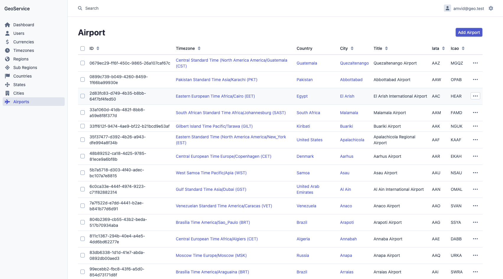

# GeoService

## Info

Geo data REST API service with admin dashboard to manage regions, countries, timezones, states, cities and airports.

[RoadRunner](https://roadrunner.dev) |
[PHP8.2](https://www.php.net/releases/8.2/en.php) |
[Symfony 6](https://symfony.com) |
[EasyAdminBundle](https://symfony.com/bundles/EasyAdminBundle/current/index.html)

### Admin Dashboard




### Installation

```bash
make install
make migrate
```

### Create a user

```bash
make user
```

### Tests

```bash
make test
```

### Import

All geo data

```bash
make geo
```

Currencies

```bash
make currencies
```

Timezones

```bash
make timezones
```

Regions

```bash
make regions
```

Sub regions

```bash
make subregions
```

Countries

```bash
make countries
```

States

```bash
make states
```

Cities

```bash
make cities
```

Airports

```bash
make airports
```

## API example

### Airport

#### Create 

POST /api/v1/airports

Request
```json
{
  "title": "Trondheim Airport Vaernes",
  "cityTitle": "Trondheim",
  "timezone": "Europe/Oslo",
  "iata": "TRD",
  "icao": "ENVA",
  "longitude": 10.9239997864,
  "latitude": 63.4578018188
}
```

Response
```json
{
  "id": "a6394382-f2f5-42b6-9e92-f1f9a357045a",
  "title": "Trondheim Airport Vaernes",
  "iata": "TRD",
  "icao": "ENVA",
  "longitude": 10.9239997864,
  "latitude": 63.4578018188,
  "altitude": null,
  "timezone": {
    "id": "1013a9a5-1427-4e5b-8971-b97a442fb3cb",
    "title": "Central European Time Europe/Oslo (CET)",
    "code": "Europe/Oslo",
    "utc": "UTC+01:00"
  },
  "city": {
    "id": "72ebbfde-d2b0-48a1-961e-092a2057ef0a",
    "title": "Trondheim",
    "longitude": 10.9239997864,
    "latitude": 63.4578018188,
    "altitude": null,
    "state": null,
    "country": {
      "id": "20a21c8b-4003-482a-83c5-7dbf816d20f2",
      "title": "Norway",
      "nativeTitle": "Norge",
      "iso2": "NO",
      "iso3": "NOR",
      "numericCode": "578",
      "phoneCode": "47",
      "flag": "🇳🇴",
      "tld": ".no",
      "longitude": 10,
      "latitude": 62,
      "altitude": null,
      "currency": {
        "id": "06f8198b-6c60-4cfe-afa0-4c65ebb1002f",
        "name": "Norwegian Krone",
        "code": "NOK",
        "symbol": "kr"
      },
      "subRegion": {
        "id": "a2543731-e2a1-4f19-b89e-20b8948b7317",
        "title": "Northern Europe",
        "region": {
          "id": "40c05d1c-f88b-4aad-9754-e1a597797160",
          "title": "Europe"
        }
      },
      "timezones": [
        {
          "id": "1013a9a5-1427-4e5b-8971-b97a442fb3cb",
          "title": "Central European Time Europe/Oslo (CET)",
          "code": "Europe/Oslo",
          "utc": "UTC+01:00"
        }
      ]
    }
  }
}
```

### More [here](https://github.com/amvid/geo-service/tree/main/docs/api)

License
-------

This software is published under the [MIT License](LICENSE.md)

[1]: https://github.com/amvid/geo-service/tree/main/LICENSE.md
